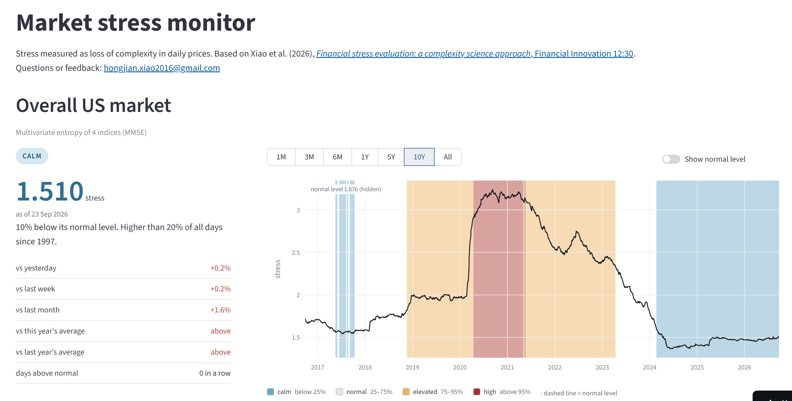

# Market Stress Monitor

A live monitor of US financial market stress, based on the entropy method from my peer-reviewed paper.

**Live app:** https://market-stress-complexity-science.streamlit.app



## The idea

In calm markets, daily prices move close to randomly, so their sample entropy is high. In a crisis, panic buying and selling make prices more predictable and entropy falls. The monitor therefore measures stress as **1 / entropy**: the higher the value, the more stressed the market.

This follows the complexity-loss view of stress developed in:

> Xiao H., Xu Y. L., Cukic A., Constantinides A. G., Mandic D. P. (2026). *Financial stress evaluation: a complexity science approach.* Financial Innovation 12:30. https://doi.org/10.1186/s40854-025-00836-2

## What the app shows

- **Overall US market:** multivariate sample entropy (MMSE) of the S&P 500, Dow Jones, NASDAQ Composite and Russell 2000 together
- **Individual indices:** univariate sample entropy (MSE) of each index, with price and daily returns
- **Status:** calm, normal, elevated or high, based on where today's stress sits in its own history
- **Comparisons:** change vs yesterday, last week and last month, distance from the normal level, recent averages, and returns

The history is updated automatically every day.

## Method

For each trading day:

1. Remove the local trend with a 5-day trailing moving average
2. Take the previous 4 years of data (1,044 trading days)
3. Compute sample entropy with embedding dimension m = 2 and tolerance r = 0.15 × std (for MMSE, r = 0.15 × number of channels, following Ahmed & Mandic)
4. Stress = 1 / entropy

**Status** compares today's stress with all earlier days (no look-ahead):

| Status | Percentile in history |
|---|---|
| calm | below 25% |
| normal | 25–75% |
| elevated | 75–95% |
| high | above 95% |

**Differences from the paper.** The paper uses a centred moving average, which needs future prices. The app uses a trailing moving average so that every value only depends on data available on that day, which is required for real-time monitoring. The overall shapes are very similar; exact values differ slightly.

## Project structure

```
app.py               web page (Streamlit): layout, charts, request form
entropy_stress.py    engine: data download, detrending, sample entropy, metrics
data/                saved stress history, updated incrementally
requirements.txt     Python packages
```

The website never rebuilds the full history. It loads the saved history from `data/` and only calculates new trading days, which takes seconds.

## Run locally

```
pip install -r requirements.txt
python entropy_stress.py      # build the full history (about 20+ minutes, only needed once)
streamlit run app.py
```

The request form sends email through Gmail. To enable it, create `.streamlit/secrets.toml` (never commit this file):

```
[email]
user="your.address@gmail.com"
app_password="your Gmail app password"
to="your.address@gmail.com"
```

Without it, the page shows a contact link instead.

## Data

Daily closing prices from Yahoo Finance (via `yfinance`), from 1991 onwards.

This project is for research and education, not investment advice.

## Contact

Hongjian Xiao · hongjian.xiao2016@gmail.com

Questions, ideas or requests for new tickers are welcome, also through the form in the app.
